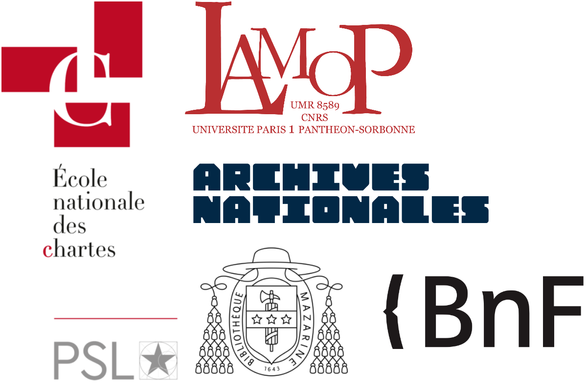

# Transcription et éditions TEI des registres NDP

Ce dépôt contient le matériel et les outils de suivi pour la transcription et l'édition TEI des registres 
du projet e-NDP.

## Sommaire

1. [Tableau de suivi](#tableau-de-suivi)
2. [Arborescence du dépôt](#arborescence-du-dépôt)
3. [Projet e-NDP](#projet-e-ndp)

### Tableau de suivi

Légende :

    - 🔄 : En cours de traitement
    - ✅ : Terminé
    - 🔎 : En révision 
    - 🚧 : Non débuté

| Registres | Transcripteurs | Pages     | Images                                         | Transcription  | ODT > TEI | TEI > TEI e-NDP | Conformité / Validation | Post-traitements (NEL, dates ISO, liens images Nakala, identifiants consolidés) | Reprise/vérification expert | Conformité / Validation | Merge TEI |
|----------|----------------|-----------|------------------------------------------------|----------------|-----------|-----------------|-------------------------|---------------------------------------------------------------------------------|---------------------------|------------------------|-----------|
| LL108    | Anne           | 1-200     | FRAN_0393_10715_L.jpg / FRAN_0393_10914_L.jpg  | 🔄             | 🚧        | 🚧              | 🚧                     | 🚧                                                                              | 🚧                         | 🚧                     | 🚧        |
| LL108    | Hugo           | 201-300   | FRAN_0393_10915_L.jpg / FRAN_0393_00324_L.jpg  | 🔄             | 🚧        | 🚧              | 🚧                     | 🚧                                                                              | 🚧                         | 🚧                     | 🚧        |
| LL108    | Philippe       | 301-350   | FRAN_0393_00325_L.jpg / FRAN_0393_00372_L.jpg  | 🔄             | 🚧        | 🚧              | 🚧                     | 🚧                                                                              | 🚧                         | 🚧                     | 🚧        |
| LL108    | Sébastien      | 351-497   | FRAN_0393_00373_L.jpg / FRAN_0393_00519_L.jpg  | 🔄             | 🚧        | 🚧              | 🚧                     | 🚧                                                                              | 🚧                         | 🚧                     | 🚧        |
| LL117    | Darwin         | 1-199     | FRAN_0393_05211_L.jpg / FRAN_0393_05409_L.jpg  | 🔄             | 🚧        | 🚧              | 🚧                     | 🚧                                                                              | 🚧                         | 🚧                     | 🚧        |
| LL117    | Véronique      | 200-399   | FRAN_0393_05410_L.jpg / FRAN_0393_05609_L.jpg  | 🔄             | 🚧        | 🚧              | 🚧                     | 🚧                                                                              | 🚧                         | 🚧                     | 🚧        |
| LL117    | Fabrice        | 400-450   | FRAN_0393_05610_L.jpg / FRAN_0393_05660_L.jpg  | 🔄             | 🚧        | 🚧              | 🚧                     | 🚧                                                                              | 🚧                         | 🚧                     | 🚧        |
| LL117    | Philippe       | 451-506   | FRAN_0393_05661_L.jpg / FRAN_0393_05716_L.jpg  | 🔄             | 🚧        | 🚧              | 🚧                     | 🚧                                                                              | 🚧                         | 🚧                     | 🚧        |
| LL105    | Olivier        | 1-72      | FRAN_0393_09066_L.jpg / FRAN_0393_09141_L.jpg  | 🔄             | 🚧        | 🚧              | 🚧                     | 🚧                                                                              | 🚧                         | 🚧                     | 🚧        |
| LL105    | Julie          | 73-144    | FRAN_0393_09142_L.jpg / FRAN_0393_09213_L.jpg  | 🔄             | 🚧        | 🚧              | 🚧                     | 🚧                                                                              | 🚧                         | 🚧                     | 🚧        |
| LL105    | Elisabeth      | 145-215   | FRAN_0393_09214_L.jpg / FRAN_0393_09284_L.jpg  | 🔄             | 🚧        | 🚧              | 🚧                     | 🚧                                                                              | 🚧                         | 🚧                     | 🚧        |
| LL105    | Isabelle       | 216-279   | FRAN_0393_09285_L.jpg / FRAN_0393_09348_L.jpg  | 🔄             | 🚧        | 🚧              | 🚧                     | 🚧                                                                              | 🚧                         | 🚧                     | 🚧        |

### Arborescence du dépôt

```
 endp-edition/ (👉 Vous êtes ici !)
|
├── assets/ (docs spécifiques pour le readme)
│   
├── tei/ (sources tei, WIP)
|
└── transcription/ (matériel et version pour la transcription des registres)
     ├── endp_ll105/ (pages .odt utilisées pour la transcription du registre LL105, base HTR fournie)
     ├── endp_ll108/ (pages .odt utilisées pour la transcription du registre LL108, base HTR fournie)
     ├── endp_ll117/ (pages .odt utilisées pour la transcription du registre LL117, base vérité terrain e-Scriptorium fournie)
     ├── guidelines.odt (source .odt pour mettre à jour le fichier pdf de guidelines)
     ├── guidelines.pdf (guidelines de transcription des registres, ⚠️ lecture requise avant de débuter la transcription)
     ├── README.md (contient les liens vers les images des registres pour l'aide à la transcription)
     
```

### Projet e-NDP

- Blog du projet ANR e-NDP : https://endp.hypotheses.org/
- Le projet est porté par [cinq institutions partenaires](https://endp.hypotheses.org/partenaires) : 

----

<div style="display: flex; justify-content: space-between;">
    
    
</div>
